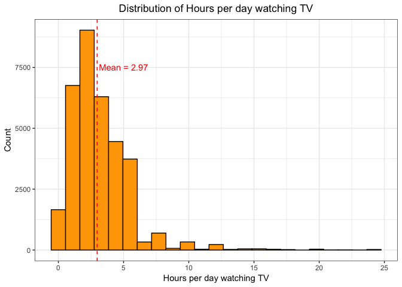
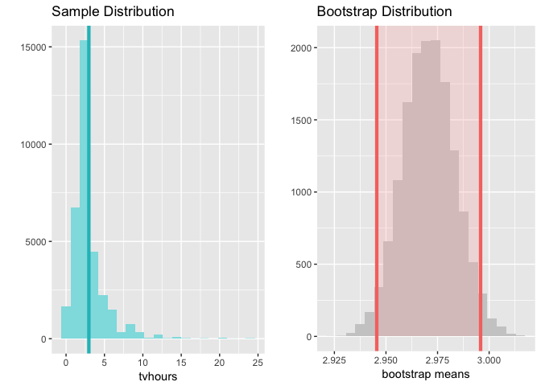
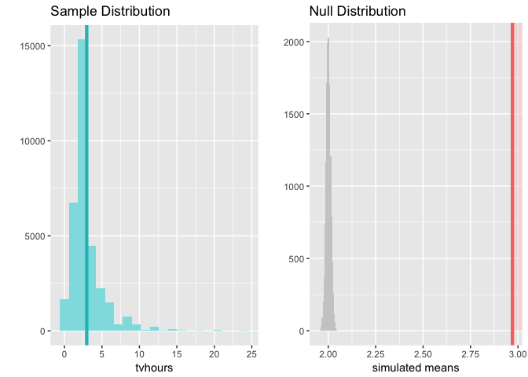

Statistical inference with the GSS data
================
Said Jiménez

Setup
-----

### Load packages

``` r
library(ggplot2)
library(dplyr)
library(statsr)
```

### Load data

``` r
load("gss.Rdata")
```

------------------------------------------------------------------------

Part 1: Data
------------

It is an excerpt from the General Social Survey (GSS) Cumulative File 1972-2012, which has the purpose of monitoring trends in the attitudes, behaviors and attributes of contemporary American society.

The data was obtained through individual interviews with people 18 years of age or older, who were living at that time in the United States. The data was collected using at least two types of random sampling, in order to represent the population of the United States.

Considering that this is an extract from the original survey, we should have doubts about the generalization of the conclusions derived from the analysis. If it were the case that we had the original survey, we could have more confidence in the generalization.

Given that these are observations obtained from a non-experimental study, we can not draw conclusions that imply causal relationships between the analyzed variables.

------------------------------------------------------------------------

Part 2: Research question
-------------------------

A recent study suggests that limiting the time people spend watching TV to less than 2 hours a day can have a positive impact on their life time. The article indicates that people who watch TV less than two hours a day, could increase their life expectancy by almost a year and a half. You can check the paper [here](http://bmjopen.bmj.com/content/2/4/e000828).

Despite negative consequences that may have the time that people watch TV, the author of this exercise has the suspicion that the population in the United States watches TV more than two hours a day. Therefore, the research question is:

Does the sample data provide significant evidence that the US population watches TV more than 2 hours a day?

------------------------------------------------------------------------

Part 3: Exploratory data analysis
---------------------------------

As part of the exploratory data analysis, we represent the distribution of the number of hours per day that people watch TV.



We can observe that the distribution is unimodal, has a mean of 2.97 and is strongly right skewed. It can be noted that most people in the sample watch TV between 0 and 6 hours.

``` r
# Descriptive Statistics
data %>%  
  summarise(mean = round(mean(tvhours), 2),
            med = median(tvhours),
            sd = round(sd(tvhours), 2),
            iqr = IQR(tvhours),
            min = min(tvhours),
            max = max(tvhours),
            q1 = quantile(tvhours, 0.25),
            q3 = quantile(tvhours, 0.75))
```

    ##   mean med   sd iqr min max q1 q3
    ## 1 2.97   2 2.35   2   0  24  2  4

Descriptive statistics of TV hours show that 50 % of all cases watch between 2 and 4 hours of TV per day. They also indicate that there are some people who do not watch TV and we have some cases that watch TV 24 hours a day. The standard deviation shows considerable dispersion in relation to the mean of the distribution.

The sample mean of 2.97 is a value that suggests that the population watches TV more than two hours a day.

------------------------------------------------------------------------

Part 4: Inference
-----------------

**Hypothesis:**

<li>
*H*<sub>0</sub> : *μ* = 2 (Mean of TV hours per day is 2)

<li>
*H*<sub>*A*</sub> : *μ* &gt; 2 (Mean of TV hours per day is greater than 2)

**Check assumptions:**

*Independence:* this is a random sample of 33855 people, which is undoubtedly less than 10% of the population in the United States, so it seems that we meet the independence criterion.

*Observations that come from a nearly normal distribution:* it is difficult to guarantee that we fulfill this condition, given that we do not know the population distribution and the distribution of our sample seems strongly right skewed, so we could conclude that we do not meet this assumption.

**Methods that will be used:**

Due to the strong bias of the distribution of TV hours, as well as the ignorance we have regarding the population distribution, the analysis that will be carried out will use the bootstrap re-sampling method and will make the inference via confidence intervals to 95 %.

Inference for the population mean of TV hours per day will be made by calculating the bootstrap distribution of means.15,000 random samples with replacement will be taken from the current sample, and in each case the mean of the samples will be obtain to construct the bootstrap distribution.

The 2 TV hours per day will be proposed as a null value for *μ*. The hypothesis will be one tail because we propose that the mean will be greater than 2 hours.

**Perform inference and interpretation:**

Inference is performed with the following lines of code and results are shown below:

``` r
# Confidence Intervals
inference(tvhours, data = data,
          type = "ci", statistic = "mean",
          method = "simulation", null = 2,
          alternative = "greater",
          boot_method = "se",
          seed = 1000)
```

    ## Single numerical variable
    ## n = 33855, y-bar = 2.9707, s = 2.3533
    ## 95% CI: (2.9455 , 2.9959)



Bootstrap distribution is unimodal, symmetric and centered on the value for the sample mean: 2.97. It has a standard deviation of 2.35. Due to the characteristics of the bootstrap distribution, it is possible to construct the 95 % confidence interval, which indicates that the population mean is (with 95 % confidence) between 2.9455 and 2.9959. That result is higher than the recommended mean of 2 hours.

``` r
# Hypothesis Testing
inference(tvhours, data = data,
          type = "ht", statistic = "mean",
          method = "simulation", null = 2,
          alternative = "greater",
          boot_method = "se",
          seed = 1000)
```

    ## Single numerical variable
    ## n = 33855, y-bar = 2.9707, s = 2.3533
    ## H0: mu = 2
    ## HA: mu > 2
    ## p_value = < 0.0001



Previous results would lead us to reject the null hypothesis, consistent with the confidence interval, our p-value is less than .05. The foregoing leads us to conclude that:

> There is evidence that the population mean of daily TV hours is significantly greater than 2 hours.

------------------------------------------------------------------------
