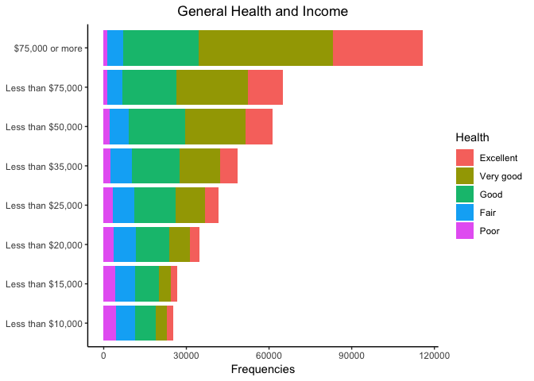
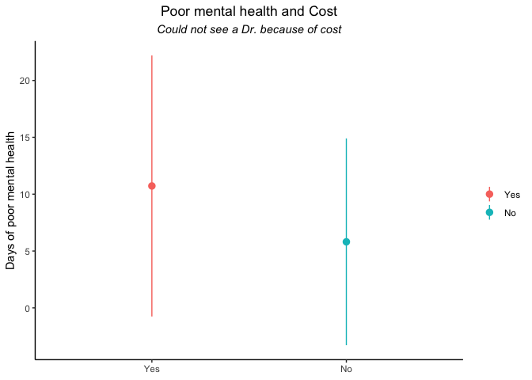
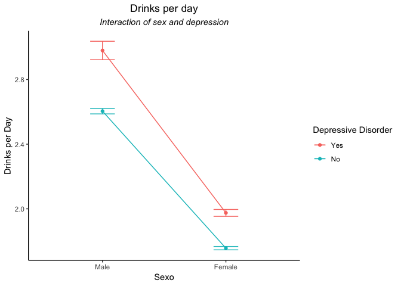

Socioeconomic Factors of Poor Physical and Mental Health
================
Said Jiménez

Setup
-----

### Load packages

``` r
library(tidyverse)
```

### Load data

``` r
load("brfss2013.RData")
```

------------------------------------------------------------------------

Part 1: Data
------------

BRFSS is an ongoing surveillance system designed to measure behavioral risk factors for the non-institutionalized adult population (18 years of age and older) residing in the US. The BRFSS was initiated in 1984, with 15 states collecting surveillance data on risk behaviors through monthly telephone interviews.

The sampling of the survey is not explicit about the use of any kind of random sampling, so it is necessary to consider that the generabizability of this data are limited to the participants involved.

This data were obtained in the context of an observational study, which does not use random assignment to any condition, so this study is not intended to determine causality. It helps to determine associations between variables, but not causality.

------------------------------------------------------------------------

Part 2: Research questions
--------------------------

**Research quesion 1:** I wanted to know if there is a relationship between monetary income and general health.

This question involves just two variables:

1.  Monetary Income

2.  General health

**Research quesion 2:** Due to the fact that there are people who could not see a Dr. because of cost, it might exist differences in the number of unhealthy (mental and physical) days between people who can pay and people who can not pay a Doctor.

This question involves four variables:

1.  Number of people who coul not see a doctor because of cost

2.  Number of poor mental health

3.  Number of poor physical health

4.  Number of poor general health

**Research quesion 3:** It is supposed that depression is related with consume of alcohol, so I explored if there was a difference in people who ever had a deppresive disorder and people who had not in the average of alcoholic drinks per day. Also I explored if this difference was related with sex of participants.

This question involves three variables:

1.  Drinks per day

2.  Have a depressive disorder

3.  Sex

------------------------------------------------------------------------

Part 3: Exploratory data analysis
---------------------------------

**Research quesion 1:**

I decided to explore two variables in order to answer my first question. I chose two categorical variables: "genhlth" and "income2", the first is about how people rate their general health and the other is how people rate their income.

``` r
# General Health
summary(brfss2013$genhlth) 
```

    ## Excellent Very good      Good      Fair      Poor      NA's 
    ##     85482    159076    150555     66726     27951      1985

``` r
 # Income
summary(brfss2013$income2)
```

    ## Less than $10,000 Less than $15,000 Less than $20,000 Less than $25,000 
    ##             25441             26794             34873             41732 
    ## Less than $35,000 Less than $50,000 Less than $75,000   $75,000 or more 
    ##             48867             61509             65231            115902 
    ##              NA's 
    ##             71426

With the aim of examine the relationship between this two variables I decided to make a cross table.

``` r
# Crosstab 
xtabs(~brfss2013$genhlth + brfss2013$income2) 
```

    ##                  brfss2013$income2
    ## brfss2013$genhlth Less than $10,000 Less than $15,000 Less than $20,000
    ##         Excellent              2319              2128              3551
    ##         Very good              3976              4567              7479
    ##         Good                   7515              8440             11948
    ##         Fair                   6929              7187              8053
    ##         Poor                   4513              4311              3674
    ##                  brfss2013$income2
    ## brfss2013$genhlth Less than $25,000 Less than $35,000 Less than $50,000
    ##         Excellent              4719              6521              9972
    ##         Very good             10800             14740             21668
    ##         Good                  14931             17287             20468
    ##         Fair                   7845              7564              7153
    ##         Poor                   3268              2575              2058
    ##                  brfss2013$income2
    ## brfss2013$genhlth Less than $75,000 $75,000 or more
    ##         Excellent             12701           32343
    ##         Very good             26044           48973
    ##         Good                  19710           27402
    ##         Fair                   5226            5645
    ##         Poor                   1421            1296

Unfortunately since there are lots of observations, the table was difficult to interpret, so I decided to make a plot of the frequencies. In the figure it is clear that the number of people who rate their General Health as "Very good" or "Excellent" increases as the income rises. It is not as clear, but also the number of people who rate his General Health as "Poor" diminishes as income rises. 

------------------------------------------------------------------------

**Research quesion 2:**

People who could not see a Dr. because of cost have poorer mental, physical ang global health than people who do not have problems with cost?

In order to examine the second question I calculated the means of days in which people reported poor mental or/and physical health, and I decided to group these means acording with the possibility or not of paying a doctor. It is important to note that I perform this analysis for three variables: Number of not good physical health, number of days of not good mental health and number of days of poor phsycal or mental health.

First, I summarized the frequencies of people who could not see a Dr. because of cost.

``` r
# Could Not See Dr. Because Of Cost
summary(brfss2013$medcost) 
```

    ##    Yes     No   NA's 
    ##  60107 430447   1221

Then, I created a new dataset by selecting and cleaning of NA the four variables that I used to answer the question: medcost, physhlth, menthlth and poorhlth.

Immediately I created three variables: "avg\_poor\_physical", "avg\_poor\_mental", "avg\_poor\_total", these are the means of days reported of poor health in each of the three domains.

We can clearly see that people who could not see a doctor because of cost have greater means of bad days in comparison of people who do not have this problem.

``` r
health_cost <- brfss2013 %>%
  select(medical_cost = medcost,
         physical_health = physhlth, 
         mental_health = menthlth, 
         poor_health = poorhlth) %>%
  filter(!is.na(medical_cost),
         !is.na(physical_health),
         !is.na(mental_health),
         !is.na(poor_health))

health_cost %>%
  group_by(medical_cost) %>%
  summarise(avg_poor_physical = mean(physical_health), # Number Of Days Physical Health Not Good
            avg_poor_mental = mean(mental_health), # Number Of Days Mental Health Not Good
            avg_poor_total = mean(poor_health)) # Poor Physical Or Mental Health
```

    ## # A tibble: 2 x 4
    ##   medical_cost avg_poor_physical avg_poor_mental avg_poor_total
    ##   <fct>                    <dbl>           <dbl>          <dbl>
    ## 1 Yes                      10.7            10.7            8.05
    ## 2 No                        8.01            5.81           4.70

In the next figure you can see that people, who say that they could not see a doctor because of cost, have a mean of almost 11 days of not good mental health. By the other side, people who do not have the problem of see a doctor have a mean of almost 6 days. The other two variables both, poor physical and poor total health, have a similar pattern.



------------------------------------------------------------------------

**Research quesion 3:**

People who have been told to have a Depressive Disorder show a greater average of alcoholic Drinks per day in comparison with those who have not been told to have a Depressive Disorder? Also I wonder if this pattern is modulated by sex?

Finally, In order to answer the third question, I revised the structure of the variables related with depressive disorder and the average of alcoholic drinks per day.

``` r
# Ever Told You Had A Depressive Disorder
summary(brfss2013$addepev2) 
```

    ##    Yes     No   NA's 
    ##  95779 393707   2289

``` r
# Avg Alcoholic Drinks Per Day In Past 30
summary(brfss2013$avedrnk2) 
```

    ##    Min. 1st Qu.  Median    Mean 3rd Qu.    Max.    NA's 
    ##    1.00    1.00    2.00    2.21    2.00   76.00  260590

First, I decided to create a new dataset, selecting and cleaning of NA the three variables of interest: sex, average of alcoholic drinks and depressive disorder.

Then, I decided to explore the mean and sd of alcoholic drinks according to the response about if they had been told they had a depressive disorder. It is important to note that it is an interaction of depressive disorder and sex which shows different patterns in the mean of alcoholic Drinks per day.

You can see that depressive people have a litlle higher mean of alcohol drinks than no depressive people. Also that male have higher mean of alcohol drinks than females, and depressive male have the highest mean of alcohol drinks per day.

``` r
sex_alc_drink <- brfss2013  %>%
  select(sex = sex, dep_disor = addepev2, drinks_day = avedrnk2) %>%
  filter(!is.na(sex), 
         !is.na(dep_disor), 
         !is.na(drinks_day)) 
  
sex_alc_drink %>%
 group_by(sex_dep_dis = sex:dep_disor) %>%
  summarise(avg_drinks_day = mean(drinks_day),
            sd_drinks_day = sd(drinks_day))
```

    ## # A tibble: 4 x 3
    ##   sex_dep_dis avg_drinks_day sd_drinks_day
    ##   <fct>                <dbl>         <dbl>
    ## 1 Male:Yes              2.98          3.40
    ## 2 Male:No               2.60          2.66
    ## 3 Female:Yes            1.97          1.79
    ## 4 Female:No             1.76          1.63

The same pattern reported is clearer depicted in the next figure which shows a little higher mean of drinks per day in male with depressive antecedents than males with no antecedents, and that this means are greater for males than for females.


