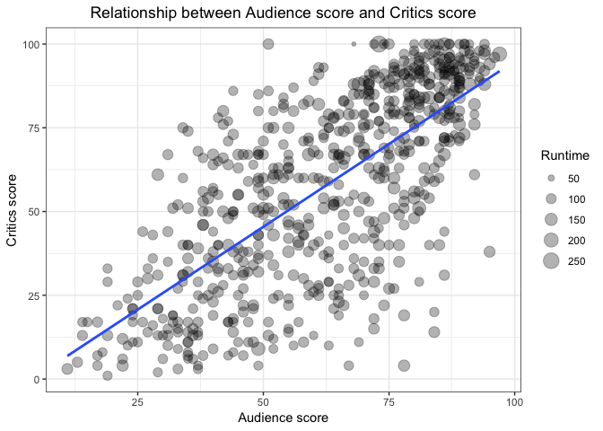
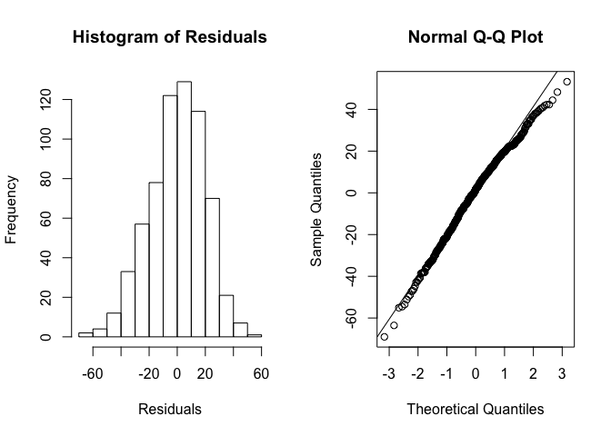
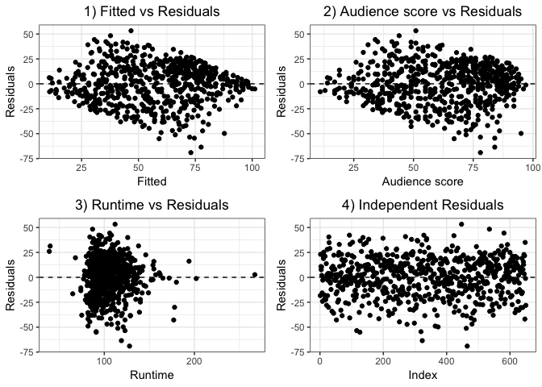

Modeling and prediction for movies
================
Said E. Jiménez

Setup
-----

### Load packages

``` r
library(ggplot2)
library(dplyr)
library(statsr)
```

### Load data

``` r
load("movies.Rdata")
```

------------------------------------------------------------------------

Part 1: Data
------------

It is a random sample of 651 films produced and released before 2016. These were obtained from Rotten Tomatoes and IMDb API's.

There is no detailed description of sampling procedures, nor of periods in which the sample was taken, it was only indicated that is a random sample. Therefore, if we assume that sampling was truly random, we can be confident that results of present analysis can be generalized to the population from which the sample was obtained.

Considering that these are data from a non-experimental study, it is not possible to infer causality of results derived from it.

------------------------------------------------------------------------

Part 2: Research question
-------------------------

A recent [article](https://www.theguardian.com/film/2018/feb/26/rotten-tomatoes-hollywood-love-hate-relationship) published in the English newspaper The Guardian, mentions that there is concern in Hollywood about whether critics score in Rotten Tomatoes can affect the success of a film. Objectivity with which Rotten Tomatoes (RT) makes its critics score has been questioned and some people consider that RT could issue evaluations that benefit certain companies like Warner Bros.

In the present document, it is thought that if RT's critics scores are valid, then they would have to be closely related to the critics scores of the audience. So, the question in this document is:

-   Is it possible to predict critics scores in RT using audience scores, considering runtime of the film and its type?

A similar idea, using only correlations is developed in other study that you can read [here](https://medium.com/vantage/cognitive-hollywood-part-1-data-shows-box-office-economics-in-turmoil-411a4b22f858).

------------------------------------------------------------------------

Part 3: Exploratory data analysis
---------------------------------

We start by selecting the variables that are of interest for the analysis: `critics_score`, `audience_score`, `runtime` and `title_type`. Also, one missing case in `runtime` variable is removed.

We continue with a quick look at the distribution of the variables, we can see that `critics_score` and `audience_score` are percentages.

``` r
# Selecting variables and remove NAs
data <- movies %>% 
  select(critics_score, audience_score, runtime, title_type) %>% 
  filter(!is.na(runtime))

# Summary
summary(data)
```

    ##  critics_score    audience_score     runtime             title_type 
    ##  Min.   :  1.00   Min.   :11.00   Min.   : 39.0   Documentary : 54  
    ##  1st Qu.: 33.00   1st Qu.:46.00   1st Qu.: 92.0   Feature Film:591  
    ##  Median : 61.00   Median :65.00   Median :103.0   TV Movie    :  5  
    ##  Mean   : 57.65   Mean   :62.35   Mean   :105.8                     
    ##  3rd Qu.: 83.00   3rd Qu.:80.00   3rd Qu.:115.8                     
    ##  Max.   :100.00   Max.   :97.00   Max.   :267.0

Subsequently, the relationship between `critics_score` and `audience_score` is visually explored, `runtime` of films is also represented in the size of the points. You can notice that there is a strong positive linear relationship between `critics_score` and `audience_score`. Regarding `runtime`, there is no clear relationship with `critics_score`.



------------------------------------------------------------------------

Part 4: Modeling
----------------

In order to model `critics_score` with multiple regression, we use stepwise forward selection to fit and compare models. Each predictor was sequentially included in the model, so that the full model had the largest *R*<sub>*a**d**j*</sub><sup>2</sup>.

We decided to include the `audience_score` variable as an external criterion that could validate the critics scores. Another variable such as IMDb ratings could be considered, however it was discarded to avoid the problem of multicollinearity with our main predictor: `audience_score` (*R* = .864). The variables `runtime` and `title_type` were selected as variables that should be controlled to better isolate the relationship between `audience_score` and `critics_score`.

In model selection, the criterion of *R*<sub>*a**d**j*</sub><sup>2</sup> was preferred instead of the p-value criterion, because *R*<sub>*a**d**j*</sub><sup>2</sup> is based on the explanation of variability, while the p-value could be considered to be based on an arbitrary value. Fitted models and the corresponding *R*<sub>*a**d**j*</sub><sup>2</sup> are included in the following table. It can be noticed that the model that explains the most variability is model 6, it includes predictors: `audience_score`, `title_type` and `runtime` in that order.

| Number | Model                                                             | *R*<sub>*a**d**j*</sub><sup>2</sup> |
|--------|-------------------------------------------------------------------|-------------------------------------|
| 1      | `lm(critics_score ~ audience_score, data)`                        | .495                                |
| 2      | `lm(critics_score ~ runtime, data)`                               | .028                                |
| 3      | `lm(critics_score ~ title_type, data)`                            | .107                                |
| 4      | `lm(critics_score ~ audience_score + runtime, data)`              | .496                                |
| 5      | `lm(critics_score ~ audience_score + title_type, data)`           | .508                                |
| 6      | `lm(critics_score ~ audience_score + title_type + runtime, data)` | .512                                |

**Interpretation of model coefficients**

Following output shows the summary of the full model, predictor `audience_score` obtained a p-value less than .05, which indicates that keeping other predictors constant, an increase of 1 % in the `audience_score`, predicts on average an increase of .91 in `critics_score`.

On the other hand, predictor `runtime` also obtained a p-value less than .05, which indicates that keeping other predictors constant, an increase of one minute in `runtime`, predicts on average an increase of .11 in `critics_score`.

Finally, the categorical variable `title_type` at its `Feature Film` level, obtained a p-value less than .05, which implies that keeping other predictors constant, a change from `Documentary` to `Feature Film`, is related on average to a significant decrease of 14 points in `critics_score`. Regarding the `TV Movie` level of `title_type`, p-value was not less than .05, which indicates that the change from `Documentary` to `TV Movie` is equal to zero.

``` r
# Full model 
mod_full <- lm(critics_score ~ audience_score + title_type + runtime, data)

# Coefficients
summary(mod_full)
```

    ## 
    ## Call:
    ## lm(formula = critics_score ~ audience_score + title_type + runtime, 
    ##     data = data)
    ## 
    ## Residuals:
    ##     Min      1Q  Median      3Q     Max 
    ## -69.028 -13.145   1.823  14.353  53.265 
    ## 
    ## Coefficients:
    ##                         Estimate Std. Error t value Pr(>|t|)    
    ## (Intercept)              2.44207    5.41406   0.451   0.6521    
    ## audience_score           0.91084    0.04173  21.828  < 2e-16 ***
    ## title_typeFeature Film -14.06397    3.03085  -4.640 4.22e-06 ***
    ## title_typeTV Movie      -4.79766    9.35257  -0.513   0.6081    
    ## runtime                  0.10629    0.04155   2.558   0.0108 *  
    ## ---
    ## Signif. codes:  0 '***' 0.001 '**' 0.01 '*' 0.05 '.' 0.1 ' ' 1
    ## 
    ## Residual standard error: 19.85 on 645 degrees of freedom
    ## Multiple R-squared:  0.5148, Adjusted R-squared:  0.5118 
    ## F-statistic: 171.1 on 4 and 645 DF,  p-value: < 2.2e-16

**Model diagnostics**

Histogram of residuals (left) and normal probability plot (right) indicate that residuals are nearly normal distributed, so that this requirement is met.



Regarding the assumption of constant variability of residuals, the scatter plot of predictions vs residuals (1), as well as of each predictor vs residuals (2 and 3), indicate that variance is not constant, in graph 1 and 2 we can note that the variability is reduced in the minimum and maximum scores, while there is much more variability between the value 25 and 75 of the variable x. While figure 3 shows that most of residuals are concentrated around the score of 100 of `runtime` variable. So the assumption of constant variability is not met.

Finally, figure 4 explores the assumption of independence of residuals, which does not show any specific pattern so we can affirm that we comply with the assumption of independence of the residuals.

Given that we violate the assumption of constant variability, results of this paper should be taken with caution.



------------------------------------------------------------------------

Part 5: Prediction
------------------

Full model will be used to predict the `critics_score` of *Moana* movie that was released in 2016, with a runtime of 103 minutes, cataloged as a Feature Film and with an actual audience score of 89 % (Such data can be verified [here](https://www.rottentomatoes.com/m/moana_2016/)).

``` r
# Creating new data for Moana movie
movie_moana <- data.frame(audience_score = 89,
                          runtime = 103,
                          title_type = "Feature Film")

# Prediction with CI of 95 %
predict(mod_full, newdata = movie_moana, interval = "prediction", level = 0.95)
```

    ##        fit      lwr      upr
    ## 1 80.39022 41.30016 119.4803

With the result of the last chunk, we are 95 % confident that, all else being equal, the model predicts that `critics_score` for Moana movie will be between 41.3 and 119.5.

It is interesting because we are in 2018, so we know that the real `critics_score` was 96 % which is indeed in our prediction interval.

------------------------------------------------------------------------

Part 6: Conclusion
------------------

Audience scores move in the same direction as RT's critics scores, it was even possible to make a prediction about a film that was not in the original sample and it was posible verify that the prediction was adequate.

The above, could suggest that the critics scores of RT are objective, however, there are limitations that must be considered, some could be:

-   Little representativeness of the sample: sample includes films until 2014, it would be useful to obtain a random sample stratified by years to improve representativeness.
-   The model had problems to comply with the assumption of constant variability, which affects estimates of the model.

Future studies would benefit from getting more data related to the money that companies invest in movies or the number of people who attend to watch them. In order to analyze more interesting relationships, as if the money invested in a film is related to critics scores of RT.

Also, it would be worth analyzing the studio, to evaluate the type of critics that is given to some studios in comparison with others. In that way, we could have more evidence on how valid the critics scores of RT are.
